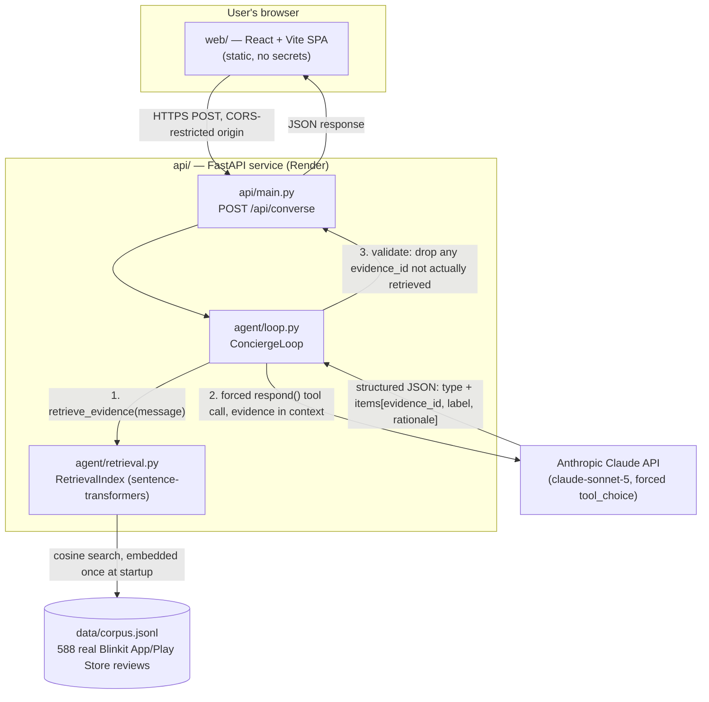
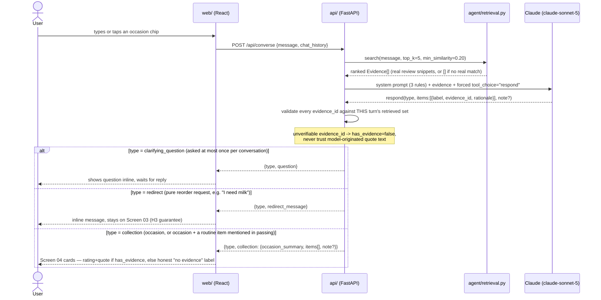
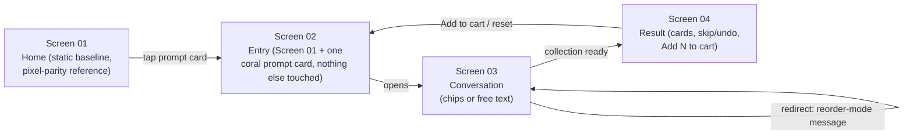

# blinkit-mvp — Occasion Concierge

Part 4 deliverable: an AI-native MVP built on the problem definition and solution selection from
the parent grad project (`NLGradProject/docs/part3-problem-definition.md` and
`docs/part4-mvp-proposal.md`).

**Chosen solution: Occasion Concierge** — a conversational agent that turns a stated occasion
("friends coming over tonight") into a curated, trust-signal-backed product collection, layered
onto the existing Blinkit home without touching the reorder flow (Buy Again, search, categories).
Every rating and review quote it shows is read directly from a real, vendored Blinkit review
corpus by ID — never generated by the model — because the whole product argument (H2, see
`docs/part4-mvp-proposal.md`) rests on trust signals being real, not just plausible-looking.

## Architecture

Two independently deployed services, on purpose: `api/` is the only process that ever holds
`ANTHROPIC_API_KEY`, so it can never end up in browser-servable code the way `web/`'s static
files are.



## Workflow — one conversation turn

The anti-fabrication guarantee lives in step 6 below, in code, not just in the prompt: the
review text and rating shown to the user are always read out of the `Evidence` retrieved that
turn, keyed by `evidence_id` — the model never originates quote text itself, and if it cites an
id that wasn't actually retrieved, that item is downgraded to "no evidence" rather than trusted.



## Screen flow



## Contents

- [`design/mockup.html`](design/mockup.html) — high-fidelity mobile mockup: baseline home →
  Concierge entry point → conversation → curated result, plus a differentiation table against
  the production app.
- [`docs/differentiation.md`](docs/differentiation.md) — the full write-up validating how this
  differs from what already ships, mapped back to the three hypotheses from Part 3.
- [`docs/part4-architecture.md`](docs/part4-architecture.md) — phase-wise build plan, with a
  detailed architecture doc per phase under [`docs/phases/`](docs/phases/).
- `agent/` — retrieval + the Claude tool-use loop (Phases 0–1), framework-agnostic.
  - `retrieval.py` — embeds `data/corpus.jsonl` once (`all-MiniLM-L6-v2`), cosine search with a
    similarity floor (no forced low-quality matches).
  - `loop.py` — one Claude call per turn, forced `tool_choice="respond"`; validates every
    `evidence_id` against what was actually retrieved that turn.
  - `prompts.py` — the system prompt encoding the three structural rules (≤1 clarifying
    question, never fabricate, stay occasion-scoped / redirect pure reorder requests, but help
    with mixed occasion+routine-item messages rather than fully bouncing them).
  - `schema.py` — framework-agnostic dataclasses shared by `agent/` and mirrored by `api/schemas.py`.
- `api/` — thin FastAPI service wrapping `agent/` over HTTP (Phase 2 backend). The only process
  that holds `ANTHROPIC_API_KEY`. Warms the retrieval index at startup (not on first request) so
  a slow/heavy cold load shows up in boot logs, not as a confusing request timeout.
- `web/` — React + Vite + TypeScript + Tailwind SPA (Phase 2 frontend), talks to `api/` only.
  Two occasion chips (Gifting Corner, Party With Friends — real merchandising tile names, not
  invented) on Screen 03 for one-tap entry alongside free text.
- `data/corpus.jsonl` — vendored, read-only Part 1 review corpus (588 tagged items). Real App
  Store / Play Store review text about the Blinkit *app* experience, not a per-product catalog —
  see `agent/retrieval.py`'s docstring for what that does and doesn't support.
- `tests/` — retrieval smoke test, API contract tests (mocked, no API key needed), and a live
  agent-loop test against the real Claude API (skipped unless `ANTHROPIC_API_KEY` is set).
- `web/src/**/*.test.tsx` — Vitest + React Testing Library coverage for the skip/undo flow, the
  chip flow, and evidence/no-evidence rendering.
- `render.yaml`, `web/vercel.json` — deploy configs for `api/` and `web/` respectively.

## Status

Built, tested, and deployed.

- **Frontend (Render Static Site):** https://blinkit-mvp-frontend.onrender.com — live.
- **Backend (Render Web Service):** https://blinkit-mvp.onrender.com — process is up
  (`/`, `/api/health` return 200), **but `/api/converse` is currently returning 502** even after
  moving index-warming into a startup hook. Under active investigation — likely the free tier's
  512MB RAM being insufficient for `torch` + the embedding model rather than a timeout, based on
  the failure now happening in ~16s instead of the ~90s cold-load window measured locally.
  Options being weighed: upgrade the Render plan, move embeddings to a hosted API (e.g. Voyage
  AI) instead of local `torch`, redeploy on Hugging Face Spaces (built for exactly this kind of
  workload, ~16GB free RAM vs. Render's 512MB), or drop the ML dependency for keyword-based
  retrieval given the corpus is only 588 records.
- **Locally:** fully verified end to end — agent loop, API, and SPA all running together, real
  Claude API calls, real corpus-grounded evidence, zero known bugs.

### Run it locally

```bash
# Backend (needs ANTHROPIC_API_KEY in the environment or a .env file, see .env.example)
python -m venv .venv && .venv/Scripts/pip install -r requirements.txt
.venv/Scripts/python -m uvicorn api.main:app --reload --port 8000

# Frontend, in a second terminal
cd web && npm install && npm run dev   # http://localhost:5173
```

### Tests

```bash
.venv/Scripts/python -m pytest tests/test_retrieval_smoke.py tests/test_api.py -v   # no API key needed
.venv/Scripts/python -m pytest tests/test_agent_loop.py -v -s                        # needs ANTHROPIC_API_KEY, real API calls
cd web && npm test                                                                    # Vitest + React Testing Library
```

24 automated tests total (9 Python without a key, 4 Python live against the real API, 11 frontend).

### Deploying

See [`docs/phases/phase-4-deploy/architecture.md`](docs/phases/phase-4-deploy/architecture.md)
for the full plan. Short version:

- **`api/`** → Render Web Service (Blueprint reads `render.yaml`, or configure manually: build
  `pip install -r requirements.txt`, start `uvicorn api.main:app --host 0.0.0.0 --port $PORT`,
  health check path `/api/health`). Needs `ANTHROPIC_API_KEY` and `CORS_ORIGINS` set in the
  dashboard (never committed).
- **`web/`** → Render Static Site or Vercel (root dir `web`, build `npm install && npm run
  build`, publish dir `dist`). Needs `VITE_API_BASE_URL` set to the deployed `api/` URL — this is
  baked in at *build* time, not read at runtime, so it must be set before the first build.
- **CORS chicken-and-egg:** deploy `api/` first with a placeholder origin, deploy `web/` to get
  its real URL, then go back and set `api/`'s `CORS_ORIGINS` to that exact URL and let it
  redeploy.

### QA/PO review (2026-08-01)

A full pass against the real API and a real browser found and fixed: an unhandled 500 on blank
messages (now a clean 422), evidence quotes rendering as full untruncated reviews instead of
short snippets, a 404 on Render's health-check probe of the bare root URL, and reorder+occasion
mixed-intent messages (e.g. "add milk for my party") being fully redirected instead of helped.
All have regression tests. Open items: H3's reorder-redirect is prompt-enforced only, with no
deterministic backstop like the fabrication guard has; the deployed backend has an open 502
issue on the real conversation endpoint (see Status above).

## Why a separate repo

This is scoped to ship independently to production (Part 4 requirement), separate from the
research/discovery-engine work in the parent project.
